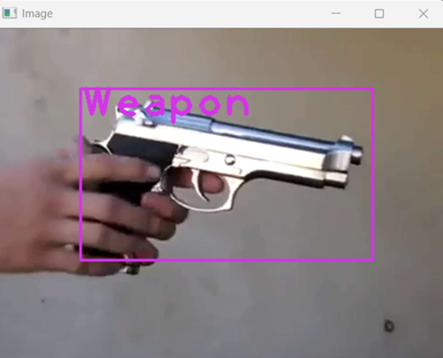

# Weapon Detection using Deep Learning for Surveillance Systems

This project implements a **deep learning–based weapon detection system** designed for surveillance applications. It detects weapons such as guns and pistols from video streams and recorded footage, making it useful for smart security systems, CCTV monitoring, and automated threat detection.

---

## 🔍 Project Description

The goal of this project is to automatically detect weapons in video frames using a trained object detection model. The system processes each frame from a video or camera feed, identifies weapons, and displays bounding boxes around detected objects.

Such systems are helpful in:

* Public security monitoring
* Automated surveillance systems
* Early threat detection
* Smart city applications

---

## 📂 Project Structure

```
Weapon-Detection-using-deep-learning-for-Surveillance-systems
│
├── weapon_detection.py        # Main detection script
├── yolov3_testing.cfg        # YOLO model configuration file
├── ak47.mp4                  # Sample test video (AK-47)
├── pistol.mp4                # Sample pistol video
├── cctv.mp4                  # CCTV sample footage
├── cctv2.mp4                 # Additional CCTV sample
├── room_ser.jpg              # Sample background image
└── README.md                 # Project documentation
```

---

## ⚙️ Technologies Used

* **Python**
* **OpenCV** – for video and image processing
* **YOLO (You Only Look Once)** – for object detection
* **NumPy** – numerical operations

---

## 🚀 Installation & Setup

### 1. Clone the Repository

```bash
git clone https://github.com/SharathKasthala/Weapon-Detection-using-deep-learning-for-Surveillance-systems.git
cd Weapon-Detection-using-deep-learning-for-Surveillance-systems
```

### 2. Create Virtual Environment (Optional)

```bash
python -m venv venv
venv\Scripts\activate   # For Windows
source venv/bin/activate # For Linux / Mac
```

### 3. Install Dependencies

If you have a `requirements.txt` file:

```bash
pip install -r requirements.txt
```

Otherwise install manually:

```bash
pip install opencv-python numpy
```

---

## ▶️ How to Run the Project

To run weapon detection on a video file:

```bash
python weapon_detection.py
```

Make sure the input video path is correctly set inside `weapon_detection.py`.

You can replace the video file with:

* `ak47.mp4`
* `pistol.mp4`
* `cctv.mp4`

---

## 🧠 Model Details

This project uses a **YOLO-based object detection model** trained to detect weapons in images and video frames.

YOLO is preferred because:

* Fast detection (real-time capable)
* High accuracy
* Works well with video streams

The configuration file used:

* `yolov3_testing.cfg`

You can replace this model with a newer YOLO version (YOLOv5 / YOLOv8) for better performance.

---

## 📊 Output

* Detected weapons are highlighted using **bounding boxes**
* Labels are displayed on detected objects
* Frames are shown in real time

## 📸 Sample Output

Below is an example of weapon detection from a surveillance video.  
The system successfully detects a weapon and highlights it using a bounding box.




---

## 🔧 Customization

You can extend this project by:

* Training with your own weapon dataset
* Adding more weapon classes (knife, rifle, etc.)
* Integrating alerts (email / sound notification)
* Connecting to live CCTV or IP camera streams
* Saving detected frames automatically

---

## 🛡️ Ethical Use

This project is intended for **educational and security research purposes only**.

Use responsibly and comply with:

* Privacy laws
* Surveillance regulations
* Ethical AI practices

---

## 📌 License

This project is open‑source. You may add a license file such as:

```
MIT License
```

---

## 🙌 Author

**Sharath Kasthala**
GitHub: [https://github.com/SharathKasthala](https://github.com/SharathKasthala)

---

## ⭐ Acknowledgements

* YOLO Object Detection Framework
* OpenCV Community
* Deep Learning Research Community

---

Feel free to fork this repository, improve the model, and contribute back!
